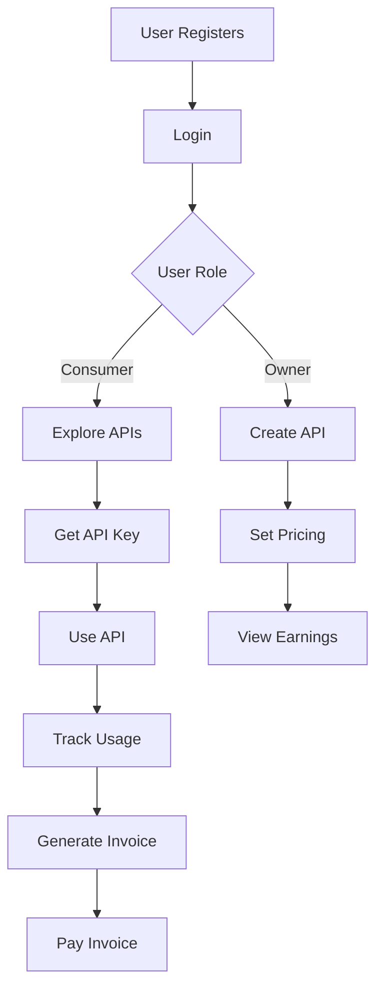
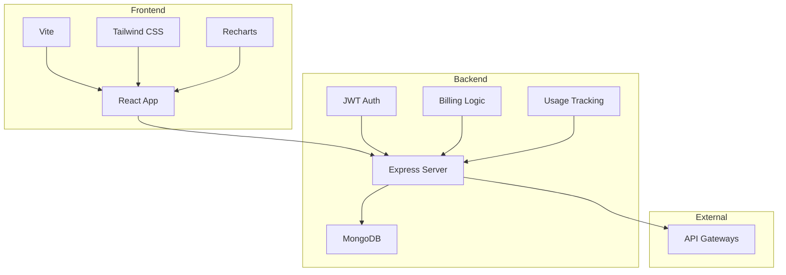

# UsageFlow

## Project Overview

UsageFlow is a comprehensive API marketplace and usage tracking platform that enables API providers to monetize their APIs while providing consumers with easy access, usage monitoring, and billing management. The platform supports role-based access with distinct functionalities for API owners, consumers, and administrators.

## Use Cases

### For API Consumers
- **API Discovery**: Browse and explore available APIs with detailed descriptions
- **API Key Management**: Generate and manage API keys for different APIs
- **Usage Tracking**: Monitor API usage in real-time with detailed analytics
- **Billing Management**: View invoices, track spending, and manage payments
- **Cost Control**: Set budgets and receive alerts for usage thresholds

### For API Owners
- **API Publishing**: Create and publish APIs with custom pricing models
- **Revenue Management**: Track earnings from API usage
- **Analytics Dashboard**: Monitor API performance and user engagement
- **Access Control**: Manage API keys and revoke access when needed

### For Administrators
- **Platform Management**: Oversee all users, APIs, and transactions
- **Billing Oversight**: Monitor overall platform billing and revenue
- **User Support**: Manage user accounts and resolve issues

## Industry Value

### API Economy Growth
- Facilitates the API economy by providing a marketplace for API discovery and consumption
- Enables API providers to monetize their services effectively
- Reduces friction in API adoption for consumers

### Cost Efficiency
- Pay-per-use model eliminates upfront costs for API consumers
- Automated billing and invoicing reduces administrative overhead
- Real-time usage tracking helps prevent unexpected costs

### Developer Productivity
- Centralized API management reduces integration complexity
- Comprehensive dashboards provide insights into API usage patterns
- Role-based access ensures security and appropriate permissions

### Business Intelligence
- Detailed analytics help API providers understand market demand
- Usage patterns inform product development and pricing strategies
- Revenue tracking enables data-driven business decisions

## Roles

### Consumer
- Basic users who consume APIs
- Can explore APIs, generate API keys, track usage, and manage billing
- Default role for new registrations

### Owner
- API providers who publish and monetize their APIs
- Can create APIs, set pricing, view earnings, and manage their API ecosystem
- Elevated permissions for API management

### Admin
- Platform administrators with full system access
- Can manage all users, APIs, and system-wide operations
- Responsible for platform maintenance and user support

## Tech Stack and Rationale

### Backend
- **Node.js**: Chosen for its scalability, large ecosystem, and excellent support for real-time applications
- **Express.js**: Lightweight web framework that provides robust routing and middleware capabilities
- **MongoDB**: NoSQL database selected for its flexibility with JSON-like documents and horizontal scalability

### Frontend
- **React**: Component-based architecture enables reusable UI components and efficient state management
- **Vite**: Fast build tool that provides instant hot module replacement and optimized production builds
- **Tailwind CSS**: Utility-first CSS framework for rapid UI development and consistent styling

### Additional Technologies
- **JWT**: Secure token-based authentication for stateless session management
- **bcrypt**: Password hashing for secure user credential storage
- **Axios**: HTTP client for reliable API communication
- **Recharts**: Data visualization library for interactive charts and graphs

### Rationale
The tech stack was selected to balance performance, developer experience, and scalability. Node.js and Express provide a fast, JavaScript-based backend that aligns with the React frontend. MongoDB's document model fits well with the API-centric data structures. Modern tools like Vite ensure fast development cycles, while Tailwind CSS enables rapid UI prototyping.

## Technologies Used and Explanation

### Core Technologies

#### Express.js
A minimal and flexible Node.js web application framework that provides a robust set of features for web and mobile applications. Used for building RESTful APIs with middleware support for authentication, CORS, and request parsing.

#### MongoDB with Mongoose
MongoDB is a document-oriented NoSQL database that stores data in JSON-like documents. Mongoose provides a schema-based solution for modeling application data with built-in type casting, validation, and query building.

#### React with React Router
React is a JavaScript library for building user interfaces with a component-based architecture. React Router enables client-side routing for single-page applications, providing navigation between different views.

#### Vite
A build tool that provides a fast development server with hot module replacement and optimized production builds. Significantly improves development experience compared to traditional bundlers.

#### Tailwind CSS
A utility-first CSS framework that provides low-level utility classes for rapid UI development. Enables consistent styling without writing custom CSS.

### Supporting Libraries

#### JWT (jsonwebtoken)
JSON Web Tokens for secure, stateless authentication. Tokens contain user information and are signed to prevent tampering.

#### bcrypt
A password hashing library that securely hashes passwords using the bcrypt algorithm, protecting against rainbow table attacks.

#### Axios
A promise-based HTTP client for making requests to external APIs and the backend. Provides interceptors for request/response handling.

#### Recharts
A composable charting library built on React components. Used for creating interactive data visualizations in the dashboard.

#### TanStack Query (React Query)
A data synchronization library for React that provides caching, background updates, and error handling for server state.

## Flow Charts

### User Flow Diagram

### System Architecture Diagram

## Conclusion

UsageFlow represents a comprehensive solution for API marketplace management, addressing the growing need for streamlined API monetization and consumption. By providing distinct roles for consumers, owners, and administrators, the platform ensures secure and efficient operations across all user types.

The carefully selected tech stack balances performance, scalability, and developer experience, enabling rapid feature development and reliable operation. The modular architecture supports future enhancements and integrations with external payment gateways and API management tools.

Key benefits include:
- **Simplified API Discovery**: Consumers can easily find and integrate APIs
- **Automated Monetization**: Owners can set pricing and track revenue effortlessly
- **Transparent Billing**: Clear usage tracking and invoicing build trust
- **Scalable Architecture**: Modern tech stack supports growing user bases
- **Developer-Friendly**: Intuitive interfaces and comprehensive dashboards

UsageFlow bridges the gap between API providers and consumers, fostering innovation in the API economy while maintaining security, transparency, and ease of use.