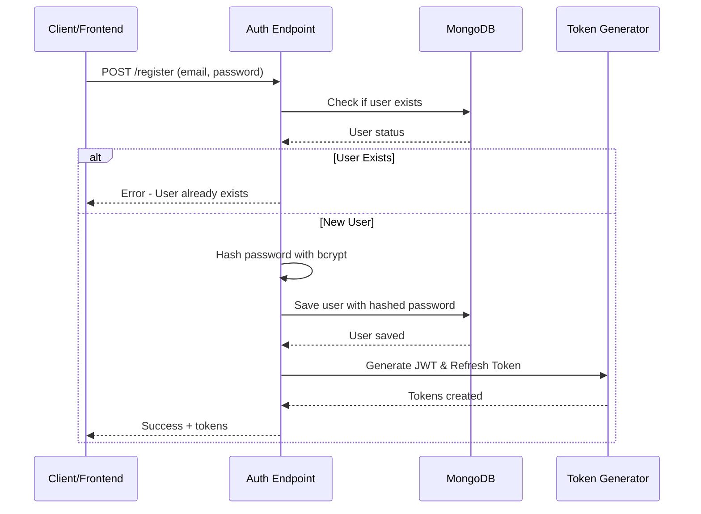
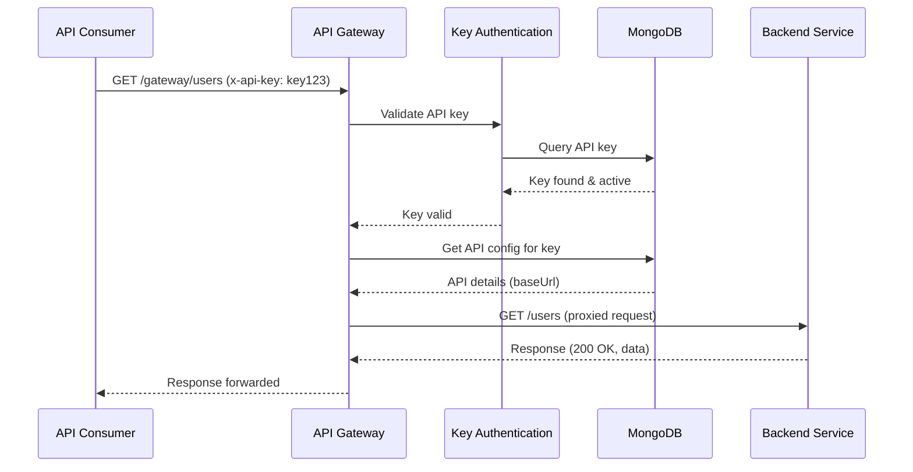
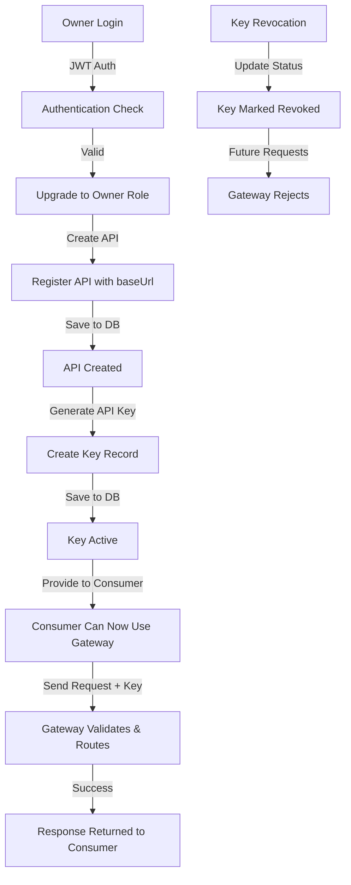
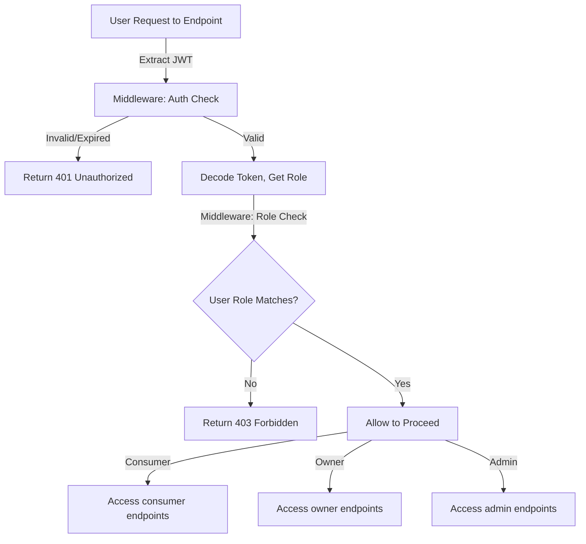
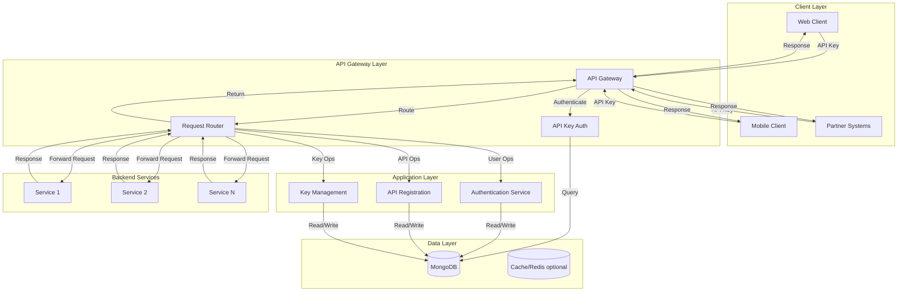

# UsageFlow API Gateway

## Introduction

**UsageFlow** is an enterprise-grade API management and gateway system that enables organizations to securely publish, manage, and monetize their APIs. Built on modern Node.js technologies, UsageFlow provides a unified platform for API providers to register their services and for consumers to discover and securely access them through a centralized gateway with comprehensive authentication and authorization controls.

In today's microservices and SaaS-driven landscape, organizations require robust mechanisms to expose APIs safely while maintaining control over usage, security, and billing. UsageFlow addresses this critical need by providing a complete API lifecycle management solution, enabling businesses to:

- Standardize API access across their ecosystem
- Implement consistent security policies
- Monitor and track API consumption
- Enable monetization and usage-based billing
- Maintain compliance and audit trails

## Use Cases

### 1. **SaaS Providers Monetizing APIs**
Companies like Stripe, Twilio, or SendGrid use API gateways to offer tiered access to their services, enabling customers to integrate while maintaining usage tracking and billing.
- **Example**: A payment processor offering different API rate limits based on subscription tiers

### 2. **Enterprise API Marketplace**
Large organizations with multiple internal and external APIs use gateways to create internal API marketplaces where different teams can publish and discover services.
- **Example**: A corporation with finance, HR, and operations APIs providing self-service access to business units

### 3. **Partner Integration Platforms**
B2B companies provide API access to partners through a secure gateway, tracking usage per partner and implementing rate limiting for fair resource allocation.
- **Example**: A retail company providing inventory and order APIs to franchise partners with usage-based billing

### 4. **Microservices Aggregation**
Organizations with distributed microservices use API gateways as a unified entry point, abstracting complexity and providing cross-cutting concerns like authentication and logging.
- **Example**: An e-commerce platform consolidating payment, inventory, and shipping microservices behind a single gateway

### 5. **Third-Party Developer Access**
Companies like AWS, Google Cloud, or GitHub provide API access to developers with fine-grained access control and usage monitoring through an API gateway.
- **Example**: A weather data provider offering APIs to developers with rate limits and usage analytics

## Industry Value

### Security & Compliance
- **Centralized Authentication**: Single point for enforcing authentication policies across all APIs
- **API Key Validation**: Secure key management with revocation capabilities
- **Audit Trails**: Comprehensive logging for regulatory compliance (SOC 2, HIPAA, GDPR)
- **Authorization Control**: Fine-grained role-based access ensuring only authorized users access specific resources

### Revenue & Monetization
- **Usage Tracking**: Detailed metrics on API consumption for accurate billing
- **Tiered Access**: Enable freemium and usage-based pricing models
- **Rate Limiting**: Protect infrastructure while offering different service tiers
- **Customer Insights**: Understand API adoption and usage patterns per customer

### Operational Excellence
- **Single Entry Point**: Simplified management of multiple backend services
- **Performance Monitoring**: Real-time visibility into API health and response times
- **Load Distribution**: Efficient routing across multiple backend instances
- **Scalability**: Handle growing API consumption without modifying individual services

### Developer Experience
- **Standardized Access**: Consistent API key authentication across all services
- **Clear Documentation**: Well-defined API contracts and rate limits
- **Quick Onboarding**: Self-service API key generation and management
- **Error Transparency**: Consistent error responses and status codes

## Features

- **User Management**: Role-based authentication with JWT tokens
- **API Registration**: Owners can register their APIs with base URLs
- **API Key Management**: Generate and revoke API keys for secure access
- **API Gateway**: Proxy requests to registered APIs using API keys
- **Usage Tracking**: Monitor API consumption per key and user
- **Role-Based Access Control**: Different permissions for consumers, owners, and admins
- **Refresh Token Mechanism**: Secure token rotation for enhanced security

## Architecture

The system consists of three main components:

1. **Authentication System**: User registration, login, and JWT-based authentication with refresh token rotation
2. **API Management**: API registration and configuration with ownership models
3. **API Gateway**: Request routing and proxying based on API keys with usage tracking

## Tech Stack & Rationale

### **Backend Framework: Node.js + Express.js**
**Why**: 
- **Non-blocking I/O**: Handles concurrent API requests efficiently, crucial for a gateway handling multiple simultaneous connections
- **JavaScript Ecosystem**: Extensive libraries for authentication, routing, and HTTP proxying
- **Performance**: Lightweight footprint with excellent throughput for I/O-bound operations like proxying
- **Developer Velocity**: Rapid development and deployment with mature tooling
- **Scalability**: Built-in clustering and horizontal scaling capabilities

### **Database: MongoDB + Mongoose**
**Why**:
- **Schema Flexibility**: Easily adapt to changing API metadata requirements without migration overhead
- **Document-Oriented**: Natural representation of API configurations, keys, and user data
- **Horizontal Scaling**: Built-in sharding for distributed deployments
- **ODM Layer (Mongoose)**: Schema validation, middleware hooks, and population for relational queries
- **Index Support**: Fast lookups on API keys and user credentials

### **Authentication: JWT (JSON Web Tokens) + Refresh Tokens**
**Why**:
- **Stateless**: No server-side session storage required, enabling horizontal scaling
- **Secure Token Rotation**: Refresh tokens enable long-lived access without compromising security
- **Cross-Origin Ready**: Works seamlessly in distributed microservices architectures
- **Industry Standard**: Widely supported and understood by the development community
- **Payload Flexibility**: Can encode user roles and permissions for fine-grained authorization

### **Security: bcrypt for Password Hashing**
**Why**:
- **Adaptive**: Automatically increases computational cost as hardware becomes faster
- **Salting**: Built-in protection against rainbow table attacks
- **Industry Standard**: Used by major platforms for password storage
- **Proven**: Extensively tested and audited in security contexts

### **HTTP Client: Axios**
**Why**:
- **Request Interceptors**: Perfect for attaching authentication headers when proxying requests
- **Timeout Management**: Prevent hanging requests to slow backend services
- **Error Handling**: Consistent error responses across different backend services
- **Promise-based**: Works seamlessly with async/await patterns

### **Security: CORS (Cross-Origin Resource Sharing)**
**Why**:
- **Control**: Specify which domains can access APIs through the gateway
- **Standards Compliant**: Follows W3C standards for cross-origin requests
- **Flexibility**: Configure per-route CORS policies if needed

## Technologies Used & Explanation

### Authentication Flow
```
User Registration/Login
         ↓
Email + Password → bcrypt hash (stored)
         ↓
Credentials valid? → Generate JWT (access token)
         ↓
Generate Refresh Token (longer expiry)
         ↓
Return both tokens to client
```

### Express.js Middleware Stack
- **Authentication Middleware**: Validates JWT tokens on protected routes
- **Role Middleware**: Checks user role against endpoint requirements
- **Error Handling**: Centralized error responses and logging
- **CORS**: Manages cross-origin requests securely

### Mongoose Schema Validation
- **Type Checking**: Ensures data integrity at the database layer
- **Indexes**: Fast queries on frequently accessed fields (API keys, user emails)
- **References**: Maintains relationships between Users, APIs, and API Keys
- **Timestamps**: Automatic tracking of creation and modification times

### API Key Generation
- **Random String Generation**: Cryptographically secure unique key creation
- **Indexed Storage**: Fast lookups during gateway authentication
- **Status Tracking**: Active/Revoked states for key lifecycle management
- **User Association**: Each key tied to a specific user account

### Gateway Proxying
- **Request Interception**: Validate API key and route to correct backend
- **Header Management**: Add/remove headers as needed for backend services
- **Response Transformation**: Optional response formatting and error standardization
- **Timeout Handling**: Prevent resource exhaustion from slow backends

## System Architecture & Flow Charts

### 1. User Authentication Flow



### 2. API Gateway Request Flow



### 3. API Creation & Key Management Flow



### 4. Role-Based Access Control Flow



### 5. Complete System Architecture



## User Roles & Permissions

UsageFlow implements a three-tier role-based access control system:

### **Consumer** (API Users)
- Can register and authenticate with email/password
- Can generate API keys for accessing published APIs
- Can use the gateway to call registered APIs
- Can manage their own API keys (revoke, regenerate)
- **Permissions**: Generate keys, call APIs through gateway

### **Owner** (API Publishers)
- All consumer capabilities
- Can create and register new APIs with base URLs
- Can manage their own published APIs
- Can view usage statistics for their APIs
- Can manage API keys for their APIs
- **Permissions**: Create APIs, manage API configurations, view analytics

### **Admin** (System Administrators)
- Full system access
- Can manage all users and their roles
- Can view all APIs and usage across the system
- Can audit all API transactions
- Can manage system-wide settings and policies
- **Permissions**: Full administrative control

## Project Structure

```
backend/
├── app.js                      # Main Express application setup
├── server.js                   # Server startup and port configuration
├── package.json                # Dependencies and scripts
├── config/
│   └── db.js                  # MongoDB connection initialization
├── controllers/
│   ├── apiController.js       # API CRUD operations
│   ├── apiKeyController.js    # API key generation and revocation
│   ├── billingController.js   # Usage tracking and billing logic
│   ├── gatewayController.js   # Request proxying and routing
│   ├── invoiceController.js   # Invoice generation
│   └── userController.js      # User authentication and management
├── middleware/
│   ├── authMiddleware.js      # JWT validation middleware
│   └── roleMiddleware.js      # Role-based authorization checks
├── models/
│   ├── Api.js                 # API schema and methods
│   ├── ApiKey.js              # API key schema and methods
│   ├── Invoice.js             # Invoice schema
│   ├── Log.js                 # Request logging schema
│   ├── Pricing.js             # Pricing tier schema
│   ├── Usage.js               # Usage metrics schema
│   └── User.js                # User schema and methods
├── routes/
│   ├── apiKeyRoutes.js        # /api/keys endpoints
│   ├── apiRoutes.js           # /api/apis endpoints
│   ├── billingRoutes.js       # /api/billing endpoints
│   ├── gatewayRoutes.js       # /gateway/* endpoints
│   ├── invoiceRoutes.js       # /api/invoices endpoints
│   └── userRoutes.js          # /api/users endpoints
├── services/
│   ├── billingService.js      # Business logic for billing
│   └── invoiceService.js      # Business logic for invoicing
└── utils/
    ├── generateApiKey.js      # Cryptographic key generation
    └── generateToken.js       # JWT token generation
```

## Installation & Setup

### Prerequisites
- Node.js (v14 or higher)
- MongoDB (local or cloud instance)
- npm or yarn package manager

### Installation Steps

1. **Clone the repository**:
```bash
git clone <repository-url>
cd UsageFlow/backend
```

2. **Install dependencies**:
```bash
npm install
```

3. **Create `.env` file** in the backend directory:
```env
# Server Configuration
PORT=5000
NODE_ENV=development

# Database Configuration
MONGODB_URI=mongodb://localhost:27017/usageflow

# JWT Configuration
JWT_SECRET=your-super-secret-jwt-key-change-this
JWT_REFRESH_SECRET=your-super-secret-refresh-key-change-this
JWT_EXPIRY=15m
JWT_REFRESH_EXPIRY=7d

# CORS Configuration
CORS_ORIGIN=http://localhost:3000

# Optional: API Rate Limiting
RATE_LIMIT_WINDOW=15m
RATE_LIMIT_MAX_REQUESTS=100
```

4. **Start MongoDB service**:
```bash
# On Windows (if installed locally)
mongod

# Or use MongoDB Atlas for cloud database
```

5. **Start the development server**:
```bash
npm start
```

The server will be available at `http://localhost:5000`

### Development with Auto-Restart
```bash
npm install -g nodemon
npm run dev
```

## API Endpoints Overview

### Authentication Endpoints
- `POST /api/users/register` - Create new user account
- `POST /api/users/login` - User login with credentials
- `POST /api/users/refresh` - Refresh access token
- `POST /api/users/upgrade` - Upgrade role to owner
- `POST /api/users/logout` - Logout and invalidate token

### API Management Endpoints
- `POST /api/apis` - Create new API (owner/admin)
- `GET /api/apis` - List user's APIs
- `GET /api/apis/:id` - Get API details
- `PUT /api/apis/:id` - Update API configuration
- `DELETE /api/apis/:id` - Delete API

### API Key Management Endpoints
- `POST /api/keys` - Generate new API key
- `GET /api/keys` - List user's API keys
- `POST /api/keys/:keyId/revoke` - Revoke API key
- `DELETE /api/keys/:keyId` - Delete API key

### Gateway Endpoints
- `ALL /gateway/*` - Proxy all requests to registered APIs

### Billing Endpoints (Enterprise)
- `GET /api/billing/usage` - Get usage statistics
- `GET /api/invoices` - List invoices
- `GET /api/invoices/:id` - Get invoice details

## Database Schema

### User Schema
```javascript
{
  email: String (required, unique, indexed),
  password: String (required, bcrypt hashed),
  role: String (enum: ["consumer", "owner", "admin"], default: "consumer"),
  refreshToken: String (optional, for token management),
  createdAt: Date (auto),
  updatedAt: Date (auto)
}
```

### API Schema
```javascript
{
  user: ObjectId (ref: User, required),
  name: String (required),
  description: String,
  baseUrl: String (required),
  status: String (enum: ["active", "inactive"], default: "active"),
  rateLimit: Number (requests per minute),
  createdAt: Date (auto),
  updatedAt: Date (auto)
}
```

### API Key Schema
```javascript
{
  key: String (required, unique, indexed, 32-char random),
  api: ObjectId (ref: API, required),
  user: ObjectId (ref: User, required),
  status: String (enum: ["active", "revoked"], default: "active"),
  lastUsed: Date (optional),
  createdAt: Date (auto),
  updatedAt: Date (auto)
}
```

### Usage Schema (for billing)
```javascript
{
  user: ObjectId (ref: User, required),
  api: ObjectId (ref: API, required),
  apiKey: ObjectId (ref: ApiKey),
  requests: Number (default: 0),
  bandwidth: Number (in bytes),
  period: String (YYYY-MM format),
  createdAt: Date (auto),
  updatedAt: Date (auto)
}
```

## Security Features

### Authentication & Authorization
- **JWT-based Access**: Stateless authentication using signed tokens
- **Refresh Token Rotation**: Secure token renewal mechanism
- **Password Security**: bcrypt hashing with salt rounds
- **Role-Based Access Control**: Three-tier permission model

### API Security
- **API Key Validation**: Every gateway request validated
- **Key Revocation**: Immediately disable compromised keys
- **CORS Protection**: Prevent unauthorized cross-origin access
- **Rate Limiting**: Protect against abuse and DDoS

### Data Protection
- **Secure Configuration**: Sensitive data in environment variables
- **Input Validation**: Request validation before processing
- **Error Handling**: Safe error messages without data leakage
- **Audit Logging**: Track all API access and changes

## Deployment Considerations

### Horizontal Scaling
- **Stateless Design**: JWT tokens eliminate session management
- **Load Balancer**: Distribute traffic across multiple gateway instances
- **Database Replication**: Use MongoDB replica sets for high availability
- **Caching**: Implement Redis for API key caching and session storage

### Monitoring & Observability
- **Request Logging**: Log all gateway requests for audit trails
- **Performance Metrics**: Track response times and error rates
- **Health Checks**: Implement health endpoints for load balancers
- **Error Tracking**: Integrate with error monitoring (e.g., Sentry)

### Production Deployment
- Use HTTPS/TLS for all communications
- Implement rate limiting per API key
- Enable CORS only for trusted domains
- Use strong JWT secret (32+ characters)
- Regularly rotate secrets and access credentials
- Implement backup and disaster recovery procedures

## Development Workflow

### Contributing Guidelines
1. Fork the repository
2. Create a feature branch (`git checkout -b feature/amazing-feature`)
3. Make your changes with clear commit messages
4. Write or update tests if applicable
5. Push to your branch
6. Submit a pull request with description

### Code Standards
- Use consistent naming conventions (camelCase for variables, PascalCase for classes)
- Write meaningful comments for complex logic
- Follow REST API conventions for endpoint design
- Include error handling for all operations

## Conclusion

**UsageFlow** represents a modern solution to API management challenges facing organizations of all sizes. By combining industry-standard technologies—Node.js for performance, MongoDB for flexibility, and JWT for security—UsageFlow provides a scalable, secure, and developer-friendly platform for API governance.

### Key Takeaways

1. **Complete API Lifecycle**: From registration to revocation, UsageFlow handles all aspects of API management
2. **Enterprise-Ready Security**: Multi-layered authentication and authorization protect both APIs and data
3. **Scalable Architecture**: Stateless design enables horizontal scaling to handle growth
4. **Developer Experience**: Intuitive API key management and clear documentation streamline integration
5. **Business Value**: Enable new revenue streams through API monetization and gain insights through usage analytics

### Future Enhancements

- **Advanced Analytics Dashboard**: Real-time visualization of API usage and performance
- **GraphQL Support**: Enable GraphQL queries through the gateway
- **API Versioning**: Support multiple API versions with deprecation warnings
- **Webhook Integration**: Event-driven workflows and notifications
- **Custom Rate Limiting**: Per-user, per-endpoint sophisticated rate limiting
- **Request Transformation**: Transform requests/responses on-the-fly
- **Authentication Methods**: Support OAuth 2.0, API tokens, and mutual TLS

UsageFlow is designed to grow with your organization, providing a foundation for secure, scalable API distribution today while remaining flexible for tomorrow's requirements.

## License

ISC License

## Support & Documentation

For issues, feature requests, or contributions, please visit the project repository. Detailed API documentation is available at `/api/docs` (if Swagger integration is added).